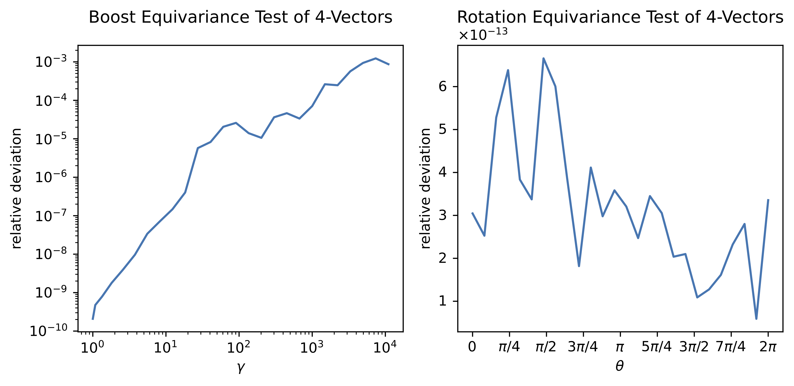

# Lorentz Group Equivariant Jet Autoencoder
## Descriptions
This jet data generative model exploits the symmetry of the [Lorentz Group](https://en.wikipedia.org/wiki/Lorentz_group), a [Lie group](https://en.wikipedia.org/wiki/Lie_group) that represents a fundamental symmetry of spacetime and describes the dynamics of relativistic objects such as elementary particles in a particle physics experiment. The model is built using the architecture of the [Lorentz Group Network](https://github.com/fizisist/LorentzGroupNetwork) introduced by Bogatskiy et al. in [arXiv:2006.04780](https://arxiv.org/abs/2006.04780) (see the `README` file in each directory for more details).

To achieve Lorentz equivariance, the model works on the [irreducible representations](https://en.wikipedia.org/wiki/Irreducible_representation) of the [Lorentz group](https://en.wikipedia.org/wiki/Representation_theory_of_the_Lorentz_group) $\mathrm{SO}(1,3)$. For instance, Lorentz scalars are $(0,0)$ representations, and 4-vectors, such as the particle 4-momenta, are $(1/2,1/2)$ representations. Each representation has its transformation rules. That the model is equivariant implies that each parameter in the model will transform according to its corresponding transformation rule if the input undergoes a Lorentz transformation. In this way, the model can always generate data that satisfy the special relativity, and the latent space, since all internal parameters are Lorentz tensors, can possibly be more physically interpretable. 
The diagram for a message passing is shown below.
<center>

</center>

## Download Dataset
To download data:
1. Install `JetNet`:
    ```
    pip3 install jetnet; 
    ```
2. Run `preprocess.py`
    ```
    python utils/data/preprocess.py \
    --jet-types g q t w z \
    --save-dir "./data"
    ```

## Train the model
An example training looks like this.
```
mkdir -p results;

python -u main.py \
--data-paths "./data/g_jets_30p_p4.pt" "./data/q_jets_30p_p4.pt" \
--test-data-paths "./data/g_jets_30p_p4.pt" "./data/q_jets_30p_p4.pt" \
-j QCD \
-e 50 \
-bs 512 \
--train-fraction 0.75 \
--lr 0.0005 \
--loss-choice chamfer \
--get-real-method sum \
--tau-latent-vectors 8 \
--tau-latent-scalars 1 \
--maxdim 2 \
--l1-lambda 1e-8 \
--l2-lambda 0 \
--map-to-latent "min&max" \
--mlp-width 6 \
--mlp-depth 6 \
--encoder-num-channels 3 3 4 4 \
--decoder-num-channels 4 4 3 3 \
--patience 1000 \
--plot-freq 100 \
--save-freq 200 \
--plot-start-epoch 50 \
--equivariance-test \
--num-test-batch 1024 \
--save-dir "results" \
| tee "results/training-log.txt"
```
### Some important parameters for `main.py`
- `-bs` (`batch-size`): batch size.
- `-tbs` (`--test-batch-size`): test batch size.
- `-j` (`--jet-type`): the jet type used for training (mainly used for naming files).
- `-e` (`--num-epochs`): number of epochs to train.
- `--loss-choice`: loss function to use.
- `--train-fraction`: fraction of the data used for training.
- `--data-paths`: paths to the training data.
- `--test-data-paths`: paths to the test data.
- `--map-to-latent`: aggregation method to the latent space. 
  - For `min&max`, min and max will be concatenated.
  - For `min+max`, min and max will be added.
  - For `mix`, a Lorentz group equivariant linear layer will mix the irreps to the latent space.
- `--maxdim`: maximum weight of representation to keep in training (recommended: 2 or 3).
- `--tau-latent-scalars`: number of (complexified) Lorentz scalars to keep in the latent space.
- `--tau-latent-vectors`: number of (complexified) 4-vectors to keep in the latent space.
- `--encoder-num-channels`: the number of channels for each representation in the encoder.
- `--decoder-num-channels`: the number of channels for each representation in the decoder.
- `--plot-freq`: frequency of plotting (plotting / epoch).
- `--plot-start-epoch`: epoch number at which to start plotting (for better GPU usage in the beginning).
- `--save-dir`: directory to save the trained model and plots.
- `--equivariance-test`: whether to test the model for equivariance.

## Test the model
The test includes reconstruction and can include Lorentz group equivariance test and anomaly detection. An example test looks like this.
```
python test.py \
-tbs 512 \
--num-test-batch 200 \
-j QCD \
--maxdim 2 \
--tau-latent-vectors 8 \
--tau-latent-scalars 1 \
--loss-choice chamfer \
--get-real-method sum \
--map-to-latent "min&max" \
--mlp-width 6 \
--mlp-depth 6 \
--encoder-num-channels 3 3 4 4 \
--decoder-num-channels 4 4 3 3 \
--model-path "results/LGNAutoencoder_QCDJet_min&max_tauLS1_tauLV1_encoder3344_decoder4433" \
--data-paths "data/g_jets_30p_p4.pt" "data/q_jets_30p_p4.pt" \
--test-data-paths "data/g_jets_30p_p4.pt" "data/q_jets_30p_p4.pt" \
--anomaly-detection \
--signal-paths "data/t_jets_30p_p4.pt" "data/w_jets_30p_p4.pt" "data/z_jets_30p_p4.pt" \
--signal-types t w z \
--equivariance-test \
| tee -a "results/test-log.txt"
```

## Results
### Equivariance Tests
Boost and rotational equivariance tests were done on the model. The rotation angles range from $0$ to $2\pi$, and the Lorentz factors range from $0$ to $11013.2$. The model is equivariant with respect to rotation up to floating point errors and is equivariant with respect to boost in the physically relevant region (the errors increase as the Lorentz factor increases because of the floating point sensitivity of boost). 
<center>

</center>


## References
### Relevant Group Equivariant Models
- A. Bogatskiy et al., "Lorentz group equivariant neural network for particle physics", [arXiv:2006.04780](https://arxiv.org/abs/2006.04780). Repository: [Lorentz Group Network](https://github.com/fizisist/LorentzGroupNetwork).
- F. Marc et al., "A Practical Method for Constructing Equivariant Multilayer Perceptrons for Arbitrary Matrix Groups", [arXiv:2104.09459](https://arxiv.org/abs/2104.09459). Repository: [A Practical Method for Constructing Equivariant Multilayer Perceptrons for Arbitrary Matrix Groups](https://github.com/mfinzi/equivariant-MLP).

### Background Knowledge
#### Group theory and group representations
- A. Zee, ["Group Theory in a Nutshell for Physicists"](https://press.princeton.edu/books/hardcover/9780691162690/group-theory-in-a-nutshell-for-physicists). Princeton University Press, 2016. ISBN 9781400881185.
- B. Hall, "Lie Groups, Lie Algebras, and Representations: An Elementary Introduction". Graduate Texts in Mathematics. Springer, doi: [10.1007/978-3-319-13467-3](https://doi.org/10.1007/978-3-319-13467-3). ISBN 9783319134673.
- D. Arovas, ["Lecture Notes on Group Theory in Physics (A Work in Progress)"](https://courses.physics.ucsd.edu/2016/Spring/physics220/LECTURES/GROUP_THEORY.pdf). Accessed Nov. 22, 2020.
- D. Dummit and R. Foote, ["Abstract Algebra"](https://www.wiley.com/en-us/Abstract+Algebra%2C+3rd+Edition-p-9780471433347). Wiley, 3rd edition, 2003. ISBN 9780471433347.
- H. Georgi, ["Lie Algebras In Particle Physics: from Isospin to Unified Theories"](https://www.amazon.com/Lie-Algebras-Particle-Physics-Frontiers/dp/0738202339). CRC Press, 2018, doi: [10.1201/9780429499210](https://doi.org/10.1201/9780429499210). ISBN 9780429978845.
- H. Muller-kirsten and A. Wiedemann, "Introduction To Supersymmetry". World Scientific Lecture Notes In Physics. World Scientific Publishing Company, 2nd edition, 2010, doi: [10.1142/7594](https://doi.org/10.1142/7594). ISBN 9789813100961.

#### The Lorentz group and its representations
- K. Rao, "Linear Algebra and Group Theory for Physicists". Text and Readings in Physical Sciences, Springer, 2nd edition, 2006, doi: [10.1007/978-93-86279-32-3](https://doi.org/10.1007/978-93-86279-32-3). ISBN 9789386279323.
- R. Sexl and H. Urbantke, "Relativity, Groups, Particles: Special Relativity and Relativistic Symmetry in Field and Particle Physics". Springer, 2001, doi: [10.1007/978-3-7091-6234-7](https://doi.org/10.1007/978-3-7091-6234-7). ISBN 9783709162347.
- Tung Wu-Ki, "Group Theory in Physics". World Scientific, 1985, doi: [doi:10.1142/0097](https://doi.org/10.1142/0097).

#### The connection between group theory and particle physics
- E. Wigner, "On Unitary Representations of the Inhomogeneous Lorentz Group", Annals of Mathematics **40** (1939), no. 1, 149-204, doi: [10.2307/1968551](https://doi.org/10.2307/1968551).
- M. Schwartz, ["Quantum Field Theory and the Standard Model"](https://www.cambridge.org/us/academic/subjects/physics/theoretical-physics-and-mathematical-physics/quantum-field-theory-and-standard-model). Cambridge University Press, 2013. ISBN 9781107034730.
- S. Weinberg. "The Quantum Theory of Fields, Volume 1: Foundations". Cambridge University Press, 1995, doi: [10.1017/CBO9781139644167](https://doi.org/10.1017/CBO9781139644167).

#### Main Libraries
- [PyTorch](https://pytorch.org/)
- [NumPy](https://numpy.org/)
- [Matplotlib](https://matplotlib.org/)
- [scikit-learn](https://scikit-learn.org/stable/)
- [SciPy](https://scipy.org/)
- [JetNet](https://jetnet.readthedocs.io/en/latest/pages/contents.html)
- [energyflow](https://energyflow.network/)
- [Awkward](https://pypi.org/project/awkward/)
